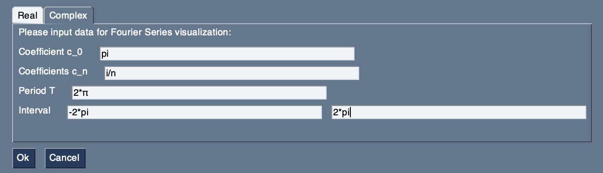
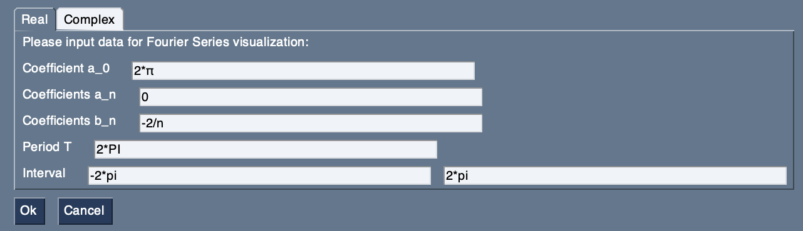
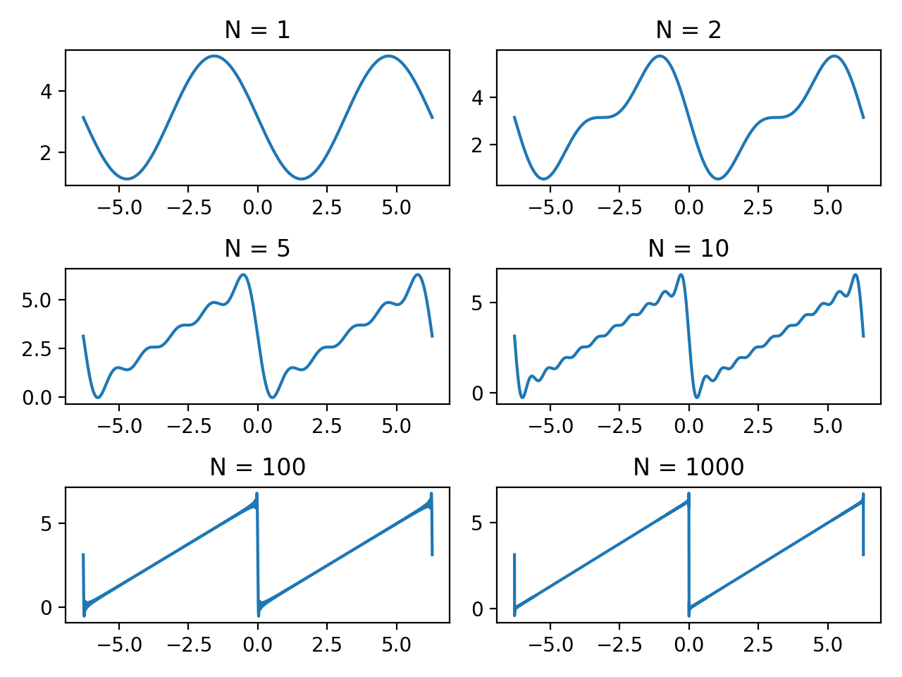

# Fourier Series
This is a small tool to help visualize the Fourier series approximation of a periodic function. It can be useful to check calculated coefficients as well as to get an idea of how good the approximation is for N harmonic oscillations.

### Example

